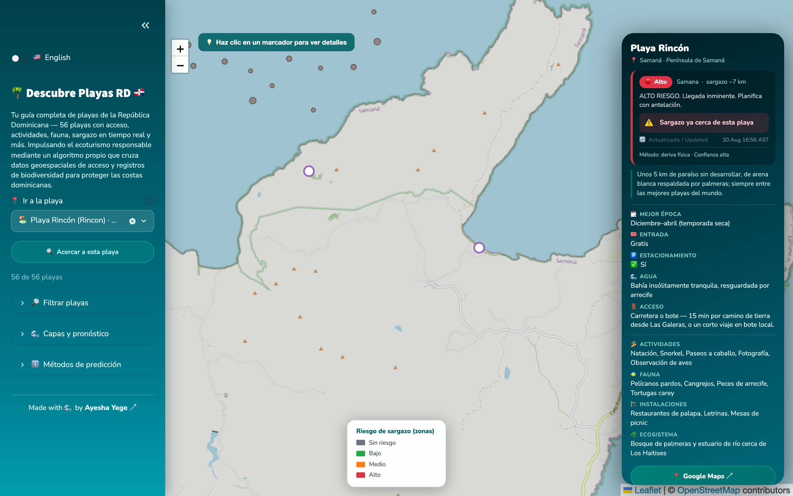
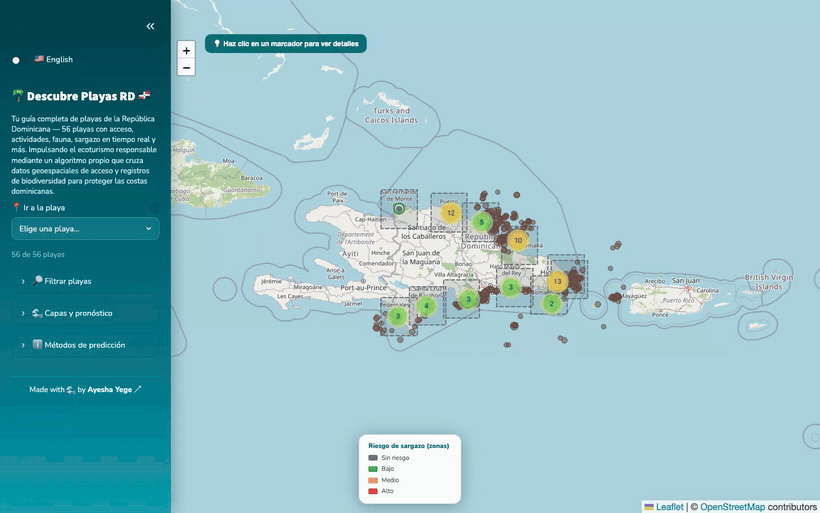
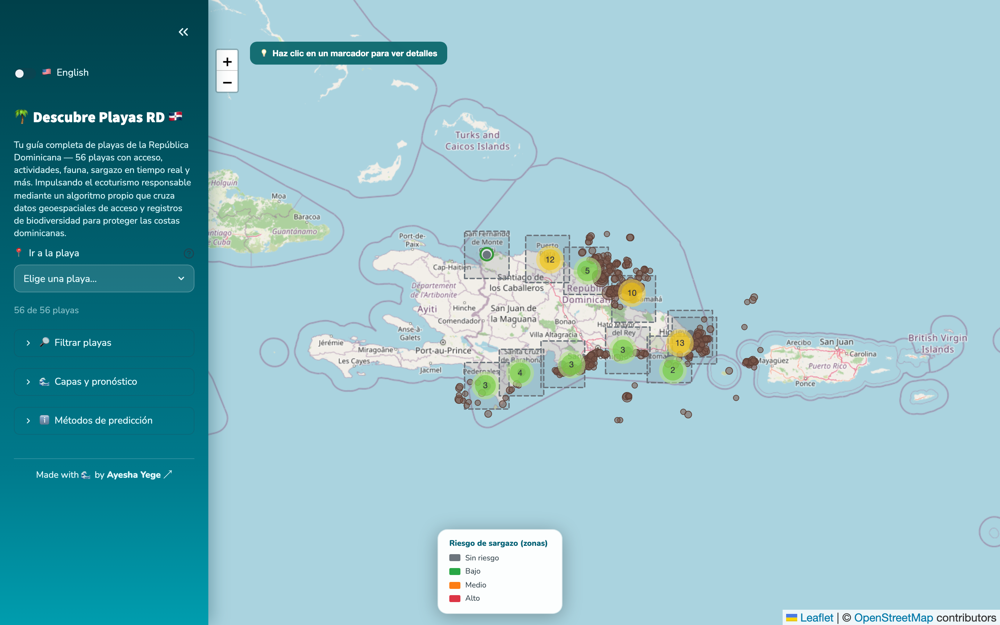
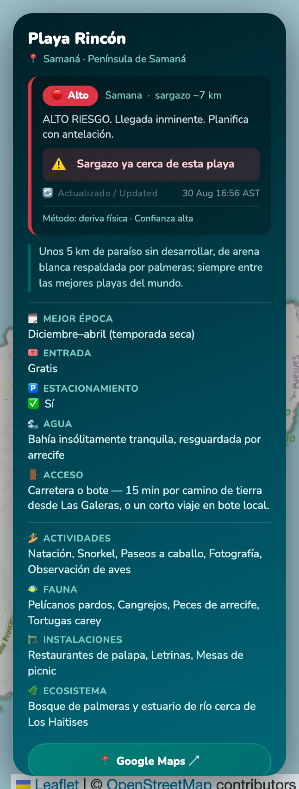
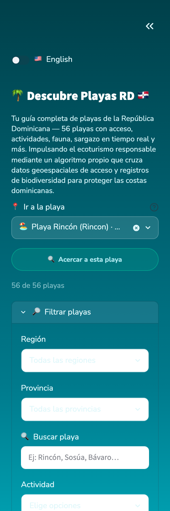

# 🌊 Sargassum Detection & Early-Warning System

> **POC** · Dominican Republic EEZ · Free-tier · ~$0/month

Detects floating sargassum from satellite imagery, models its drift with ocean currents and wind, computes an arrival ETA for 11 DR coastal zones, and sends Telegram alerts to fishermen and hotels.
Also ships a tourist **beach explorer** — 56 DR beaches with live sargassum risk, per-beach arrival time estimates, activities, wildlife, parking, and Google Maps links.
An ML extended forecast layer adds 7 / 14 / 21-day outlooks that bridge the gap between the 72-hour physics drift model and monthly seasonal climatology.

<p align="center">
  
</p>

<p align="center">
  <em>Detected sargassum masses (brown) drifting across the DR EEZ, monitoring zones (dashed), and per-beach risk with arrival ETA.</em>
</p>

---

## Quick start (5 minutes to a running dashboard)

You don't need Earth Engine or Copernicus credentials to run the beach explorer. Credentials unlock the full detection pipeline.

```bash
# 1 — clone & enter the repo
git clone https://github.com/Ayege/descubreplayas.git
cd descubreplayas

# 2 — create a Python 3.11 virtual environment
python3.11 -m venv .venv
source .venv/bin/activate        # Windows: .venv\Scripts\activate

# 3 — install all dependencies
pip install -r requirements.txt

# 4 — copy the env template and fill in your values (see table below)
cp .env.example .env

# 5 — provision the database (run once in Supabase SQL editor)
#     open sql/schema.sql and execute it in your Supabase project

# 6 — seed the beach catalog into Supabase
python -m scripts.seed_beaches

# 7 — launch the beach explorer (works offline — no API needed)
streamlit run dashboard/beaches.py
```

Open http://localhost:8501 — you'll see the interactive tropical map with 56 DR beaches.

> **To see detected sargassum on the map, the API has to be running too.** The
> explorer reads masses from `GET /detections`, so with `API_BASE_URL` pointing
> at a host that is down the map shows beaches but no sargassum. Start the API
> (below) in a second terminal and reload.

### Also run the API and risk map

```bash
# API (separate terminal)
uvicorn api.main:app --reload
# → http://localhost:8000/docs for interactive API docs

# Coastal risk map
streamlit run dashboard/app.py

# Full detection pipeline (requires EE + CMEMS credentials)
python -m pipeline.run
```

---

## Environment variables

Copy `.env.example` to `.env` and fill in every variable.
**Secrets are never hardcoded** — all config comes from the environment.

| Variable                    | Required for           | Description                                                           |
| --------------------------- | ---------------------- | --------------------------------------------------------------------- |
| `EE_PROJECT`              | Pipeline               | Google Cloud project with Earth Engine enabled                        |
| `EE_SERVICE_ACCOUNT_JSON` | Pipeline               | Path to service-account key file**or** the JSON string          |
| `CMEMS_USERNAME`          | Pipeline               | Copernicus Marine username                                            |
| `CMEMS_PASSWORD`          | Pipeline               | Copernicus Marine password                                            |
| `SUPABASE_URL`            | All                    | Supabase project URL                                                  |
| `SUPABASE_KEY`            | All                    | Service-role key (pipeline/API) or anon key (read-only)               |
| `TELEGRAM_BOT_TOKEN`      | Alerts                 | Bot token from @BotFather                                             |
| `TELEGRAM_WEBHOOK_SECRET` | Alerts                 | Shared secret echoed in Telegram's webhook header (prevents spoofing) |
| `API_BASE_URL`            | Dashboard risk overlay | Public Render URL — leave blank to skip live risk                    |
| `FORECAST_HOURS_PHYSICS`  | Pipeline (optional)    | Physics drift horizon in hours (default`72`)                        |
| `FORECAST_HOURS_EXTENDED` | Pipeline (optional)    | ML forecast horizon cap in hours (default`168` = 7 d)               |
| `ML_RETRAIN_EVERY_N_RUNS` | Pipeline (optional)    | Retrain ML model every N pipeline runs (default`28` ≈ 1 week)      |
| `WIND_DRIFT_FACTOR`       | Pipeline (optional)    | Fraction of wind speed applied as surface windage (default`0.02`)   |
| `FAI_THRESHOLD`           | Pipeline (optional)    | Floating Algae Index detection threshold (default`0.02`)            |

> **Beach explorer with no credentials** — leave `API_BASE_URL` blank.
> The map loads from the built-in dataset; the sargassum risk badges show "no data".
> Set `SUPABASE_URL`/`SUPABASE_KEY` + `API_BASE_URL` to unlock live risk overlays.

---

## Architecture

```
┌────────────┐   ┌─────────────┐   ┌───────────────┐   ┌───────────┐   ┌────────────┐
│  detect.py │ → │  ocean.py   │ → │   drift.py    │ → │  store.py │ → │dispatch.py │
│  (GEE/FAI) │   │ (CMEMS cur) │   │ (Lagrangian)  │   │ (Supabase)│   │ (Telegram) │
└────────────┘   └─────────────┘   └───────────────┘   └───────────┘   └────────────┘
                                                               │
                                         ┌─────────────────────┤
                                         ▼                     │
                                  ┌────────────┐               │
                                  │  model.py  │ (Step 6)      │
                                  │  7/14/21d  │               │
                                  │ ML forecast│               │
                                  └─────┬──────┘               │
                                        │ upsert_ml_forecasts   │
                              ┌─────────▼──────────────────────┤
                              ▼                                ▼
                       ┌────────────┐                  ┌───────────────┐
                       │  FastAPI   │                  │   Streamlit   │
                       │  api/      │                  │  dashboard/   │
                       └────────────┘                  └───────────────┘
```

**Forecast horizons handled by each step:**

| Step | Module                  | Horizon       | Method                                                              |
| ---- | ----------------------- | ------------- | ------------------------------------------------------------------- |
| 1–4 | `detect` → `drift` | 0–72 h       | Physics (Lagrangian advection + CMEMS currents)                     |
| 6    | `model.py`            | 7 / 14 / 21 d | ML (GradientBoostingClassifier), falls back to seasonal climatology |
| —   | `climatology.py`      | Monthly       | Caribbean seasonal index (always available, coarsest)               |

### Repo layout

| Path                          | Purpose                                                                  |
| ----------------------------- | ------------------------------------------------------------------------ |
| `pipeline/detect.py`        | GEE Sentinel-2 FAI detection → patch polygons                           |
| `pipeline/ocean.py`         | Copernicus Marine current + Open-Meteo wind fetch                        |
| `pipeline/drift.py`         | Lagrangian advection → 72-h zone ETA + risk                             |
| `pipeline/features.py`      | Feature engineering for the ML model (12-element vector)                 |
| `pipeline/model.py`         | GradientBoostingClassifier — 7 / 14 / 21-day extended forecasts         |
| `pipeline/store.py`         | Upsert detections, forecasts, and ML forecasts to Supabase               |
| `pipeline/dispatch.py`      | Match forecasts to subscribers, de-duplicate, send Telegram alerts       |
| `pipeline/run.py`           | Orchestrate all 6 steps; graceful per-step error handling                |
| `pipeline/config.py`        | EEZ bbox, zones, thresholds, ML settings — all from env vars            |
| `api/`                      | FastAPI: health, zones, forecasts, extended forecasts, beaches, Telegram |
| `dashboard/beaches.py`      | Streamlit beach explorer (tropical UI, bilingual ES/EN)                  |
| `dashboard/beaches_data.py` | 56-beach offline dataset (canonical, English — filters and API key on it) |
| `dashboard/beaches_i18n.py` | Spanish display layer: 183 vocabulary terms + prose for all 56 beaches   |
| `dashboard/climatology.py`  | Caribbean monthly risk index (seasonal fallback)                         |
| `dashboard/risk_overlay.py` | Live risk fetch + nearest-zone mapping                                   |
| `sql/schema.sql`            | PostGIS tables, seed zones (including La Romana), indexes, RLS policies  |
| `scripts/seed_beaches.py`   | Idempotent Supabase beach seeder                                         |
| `.github/workflows/`        | `pipeline.yml` (cron every 6 h) + `keepalive.yml` (daily ping)       |

---

## API reference

| Method   | Endpoint                | Description                                                    |
| -------- | ----------------------- | -------------------------------------------------------------- |
| `GET`  | `/health`             | Liveness + DB connectivity                                     |
| `GET`  | `/zones`              | All monitored coastal zones                                    |
| `GET`  | `/forecast`           | Latest 72-h physics forecast for every zone                    |
| `GET`  | `/forecast/{zone_id}` | Latest 72-h physics forecast for one zone                      |
| `GET`  | `/forecast/extended`  | ML extended forecasts (7/14/21 d); filter with`?lead_days=7` |
| `GET`  | `/beaches`            | Beach catalog (`?province=` / `?region=` filters)          |
| `GET`  | `/detections`         | Latest detected sargassum masses (lat/lon + area);`?limit=`  |
| `POST` | `/subscribe`          | Subscribe a Telegram chat to a zone                            |
| `POST` | `/telegram/webhook`   | Telegram Bot API update handler                                |

Interactive docs at `/docs` when the API is running.

---

## Database schema

| Table            | Description                                                                    |
| ---------------- | ------------------------------------------------------------------------------ |
| `zones`        | 11 coastal monitoring zones (PostGIS polygons + centre points)                 |
| `detections`   | Sargassum patches detected from satellite imagery (polygon + centroid + area)  |
| `forecasts`    | 72-h physics zone risk + ETA per pipeline run (with optional`horizons` JSON) |
| `ml_forecasts` | ML extended forecasts per (zone, lead_days); unique on (run_at, zone, lead)    |
| `subscribers`  | Telegram subscribers per zone                                                  |
| `beaches`      | 56 DR beaches with metadata + PostGIS point geometry                           |

Risk levels: `none` · `low` · `medium` · `high`

**Monitored zones (11):** Punta Cana · Bavaro · Samana · Puerto Plata · Juan Dolio · Barahona · Pedernales · Monte Cristi · Rio San Juan · Azua · **La Romana** *(added to cover the south-east coast gap)*

---

## Telegram bot commands

Once deployed and webhook registered:

| Command               | Action                                                         |
| --------------------- | -------------------------------------------------------------- |
| `/start`            | Welcome message + usage                                        |
| `/subscribe <zone>` | Subscribe to alerts for a zone (e.g.`/subscribe Punta Cana`) |
| `/status`           | Show current risk for all zones                                |
| `/stop`             | Unsubscribe from all alerts                                    |

---

## Deployment

| Service                             | What runs there                                  | Free tier                    |
| ----------------------------------- | ------------------------------------------------ | ---------------------------- |
| **Render**                    | FastAPI (`api/`)                               | 750 h/month free web service |
| **Streamlit Community Cloud** | `dashboard/beaches.py` or `dashboard/app.py` | Free                         |
| **Supabase**                  | Postgres + PostGIS                               | 500 MB free                  |
| **GitHub Actions**            | Pipeline cron + keep-alive                       | 2 000 min/month free         |

See `render.yaml` for the Render service definition.

---

## Tech stack

- **Language:** Python 3.11
- **Detection:** earthengine-api · geemap · geopandas · shapely · numpy
- **Ocean data:** copernicusmarine (CMEMS) · Open-Meteo (free wind API, no key)
- **Database:** Supabase (Postgres + PostGIS) via supabase-py
- **API:** FastAPI · uvicorn · pydantic
- **Bot:** python-telegram-bot / httpx
- **Dashboard:** streamlit · folium · streamlit-folium · pydeck
- **ML forecasting:** scikit-learn (GradientBoostingClassifier)
- **Scheduling:** GitHub Actions
- **Config:** python-dotenv

---

## How sargassum risk is calculated

The pipeline runs four steps automatically every 6 hours via GitHub Actions.

### Step 1 — Detection (Sentinel-2 / FAI)

Satellite imagery is pulled from the **Copernicus Sentinel-2 SR Harmonized** collection via Google Earth Engine.
Only scenes with cloud cover ≤ 40 % are used.
For each pixel inside the DR Exclusive Economic Zone (lat 17.3–21.5 °N, lon 72.1–67.3 °W) the **Floating Algae Index (FAI)** is computed:

$$
\text{FAI} = \rho_\text{NIR} - \left( \rho_\text{Red} + (\rho_\text{SWIR} - \rho_\text{Red}) \cdot \frac{\lambda_\text{NIR} - \lambda_\text{Red}}{\lambda_\text{SWIR} - \lambda_\text{Red}} \right)
$$

Pixels with FAI > threshold (default **0.02**, tunable via `FAI_THRESHOLD` env var) are flagged as floating biomass.
Contiguous flagged pixels are vectorised into patch polygons. Patches smaller than 0.05 km² are discarded as noise.

### Step 2 — Ocean forcing (Copernicus Marine / Open-Meteo)

For up to 20 patch centroids the pipeline fetches:

| Source                                                        | Variable                                               | Horizon |
| ------------------------------------------------------------- | ------------------------------------------------------ | ------- |
| **Copernicus Marine** (`GLOBAL_ANALYSISFORECAST_PHY`) | Eastward current`uo`, northward current `vo` (m/s) | 72 h    |
| **Open-Meteo** (free tier)                              | 10 m zonal wind`u`, meridional wind `v` (m/s)      | 72 h    |

### Step 3 — Drift model (Lagrangian advection)

Each patch centroid is stepped forward **1 hour at a time** over 72 hours:

$$
u_\text{eff} = u_\text{current} + \alpha \cdot u_\text{wind}
\qquad
v_\text{eff} = v_\text{current} + \alpha \cdot v_\text{wind}
$$

$$
\text{lon}_{t+1} = \text{lon}_t + \frac{u_\text{eff} \cdot \Delta t}{\cos(\text{lat}_t) \cdot 111\,320}
\qquad
\text{lat}_{t+1} = \text{lat}_t + \frac{v_\text{eff} \cdot \Delta t}{111\,320}
$$

where $\Delta t = 3600$ s and $\alpha = 0.02$ (2 % windage — empirical value for surface biomass, tunable via `WIND_DRIFT_FACTOR`).

When a patch centroid enters a **zone bounding box** (0.1 ° half-width square around each coastal zone centre), the arrival hour and projected area are recorded.

### Step 4 — Risk classification

For each coastal zone the pipeline accumulates the total patch area projected to arrive within 72 hours and the earliest arrival time (ETA):

| Risk level | Condition                                                  |
| ---------- | ---------------------------------------------------------- |
| `none`   | No patch projected to reach the zone within 72 h           |
| `low`    | Projected area <**1 km²**                           |
| `medium` | Projected area**1–10 km²**                         |
| `high`   | Projected area >**10 km²** OR ETA ≤ **24 h** |

Thresholds are tunable via `RISK_AREA_LOW_MAX_KM2`, `RISK_AREA_MEDIUM_MAX_KM2`, and `RISK_HIGH_ETA_HOURS` in `pipeline/config.py`.

### What the dashboard shows

Each beach on the map is matched to the **nearest monitoring zone** by Haversine distance.
The zone's risk level, ETA, and projected arrival timestamp are displayed in the beach detail panel.
Forecasts are refreshed every 6 hours when the pipeline runs.

### Step 5 — Telegram alerts (dispatch)

After forecasts are stored, `dispatch.py` queries subscribers and sends de-duplicated Telegram alerts for zones where risk changed to `high`. A `last_alerted` timestamp prevents the same alert from being resent within the same pipeline cycle.

Alert format (Spanish, low-bandwidth):

```
ALERTA SARGAZO — Punta Cana: riesgo HIGH. Llegada estimada ~18h (15:00 hora DR). Planifica con tiempo.
```

### Step 6 — ML extended forecast (7 / 14 / 21 days)

Beyond 72 hours the physics model diverges from reality because small errors in current and wind forecasts compound. `pipeline/model.py` fills the 3–21 day gap using a trained **GradientBoostingClassifier**.

**Feature vector** (12 inputs, defined in `pipeline/features.py`):

| Feature                      | Description                                                  |
| ---------------------------- | ------------------------------------------------------------ |
| `doy_sin`, `doy_cos`     | Day-of-year encoded cyclically — captures seasonality       |
| `month_sin`, `month_cos` | Month encoded cyclically — coarser seasonal signal          |
| `log_eez_area`             | log₁₊ total detected sargassum area in the DR EEZ (km²)   |
| `log_zone_area`            | log₁₊ estimated area within 200 km of this zone (km²)     |
| `log_nearest_km`           | log₁₊ distance to nearest detected mass (km)               |
| `log_patch_count`          | log₁₊ number of distinct patches in the EEZ                |
| `physics_risk`             | Risk integer (0–3) from the 72-h drift step for this zone   |
| `zone_lat`, `zone_lon`   | Zone centre — lets the model learn coast-specific behaviour |
| `lead_days`                | Forecast horizon (7, 14, or 21)                              |

**Training data** are assembled automatically by joining past `forecasts` rows with `detections` rows from the same pipeline run, pairing each run at time *T* with the actual recorded risk at *T + lead_days* (±12 h tolerance).

**Model lifecycle:**

- First run: no model file → seasonal climatology fallback used immediately, training skipped.
- Once ≥ 40 labelled examples accumulate in Supabase (≈ 10 pipeline days), the model trains and is persisted to `pipeline/.model_cache.pkl`.
- The model retrains every `ML_RETRAIN_EVERY_N_RUNS` pipeline runs (default `28`, ≈ 1 week at the 6-h cron cadence).

Results are stored in the `ml_forecasts` table and served at `GET /forecast/extended`.

---

## Beach explorer features

<p align="center">
  
</p>

<p align="center">
  <em>Type to find a beach → the map flies to it → zoom in → switch language. Interface <strong>and</strong> beach data are fully bilingual.</em>
</p>

<table>
  <tr>
    <td width="50%"></td>
    <td width="50%"></td>
  </tr>
  <tr>
    <td align="center"><em>Opens on the national map — no card, nothing in the way.</em></td>
    <td align="center"><em>Per-beach panel: live risk, arrival ETA, access, activities, wildlife.</em></td>
  </tr>
</table>

The `dashboard/beaches.py` app provides an interactive tropical map with:

- **56 DR beaches** catalogued with province, region, activities, wildlife, facilities, and Google Maps links.
- **"Go to beach" picker** — type-ahead search over the current results; picking one flies the map to it and opens its panel, so you never have to hunt for a pin.
- **Accent-insensitive search** — "Bavaro" finds *Playa Bávaro*, "Aguilas" finds *Bahía de las Águilas*. 13 of the 56 names carry an accent, and Streamlit's own fuzzy filter does not fold diacritics, so each affected option also shows its plain spelling.
- **Auto-framing** — narrowing a filter (region, province, activity, risk) re-frames the map on what is left, computed in Web Mercator from the result set's bounds.
- **Opens clean** — national map, no beach card. The panel appears only when you pick a beach, click a pin, or open a `?beach=…` link (which centres the map on it).
- **Fully bilingual (ES/EN)** — not just the interface: every beach description, access note, ecosystem, activity, species and facility is translated. 183 vocabulary terms plus per-beach prose live in `dashboard/beaches_i18n.py`; `beaches_data.py` stays English because the filters, the API and the Supabase seeder all key on it.
- **Live risk badges** on each beach pin (none / low / medium / high) derived from the nearest monitoring zone's latest forecast.
- **Per-beach arrival ETA** — direction-aware estimate of when the nearest approaching mass will reach the beach:
  - Only masses whose drift vector points *toward* the beach (dot product > 0.005 m/s approach speed) are considered.
  - Analytic estimate using effective drift speed, then verified hour-by-hour up to 72 h.
- **Time horizon slider (0–72 h)** — slide to see where detected masses will be in the future. Risk badges and ETAs update live.
- **Drift trails** — PolyLine showing the predicted path of each mass, with a ghost circle at its predicted position.
- **Regional current model** — four coastal regimes with Caribbean-specific current speeds:
  - East (Punta Cana / La Romana): −0.22 m/s — strong North Equatorial Current
  - North (Puerto Plata and west): −0.12 m/s
  - Southwest (Barahona / Pedernales): −0.08 m/s
  - South/central default: −0.13 m/s
- **Live wind** from Open-Meteo (free, no key required), cached 1 hour via `@st.cache_data`.
- **Custom loading spinner** (pure CSS, no JavaScript) replaces the Streamlit branding splash screen.

<p align="center">
  
</p>

<p align="center">
  <em>Sidebar: the primary action sits on top; filters, map layers and forecast settings stay collapsed until needed.</em>
</p>

---

## Development notes

- The beach explorer runs fully offline; live risk badges require `API_BASE_URL`
- One failed pipeline step logs an error but does not crash the whole run
- All times stored as UTC; Telegram alerts display local DR time (UTC−4)
- The `streamlit-folium` component is pinned at `0.27.2` — upgrading may break the map component asset loading behind custom-domain reverse proxies
- `.streamlit/config.toml` disables Streamlit's XSRF and CORS checks so the folium iframe loads correctly on `descubreplayas.com.do`
- Maps use **OpenStreetMap tiles** (free, no API key required). CartoDB tiles required an API key after their free-tier policy changed in 2023–2024.
- **No sargassum on the map usually means the API is not running.** The explorer reads masses from `GET /detections`; with `API_BASE_URL` pointing at a dead host the call returns `[]` and the map draws beaches only. Start `uvicorn api.main:app` alongside the dashboard.
- **Streamlit strips `<script>` from `st.markdown`.** Anything that must execute in the page has to go through `st.components.v1.html`, which renders a real same-origin iframe and can reach `window.parent.document` — that is how `_inject_head()` installs `<html lang>` and the meta tags. Inert `<script type="application/ld+json">` is the exception: it survives, which is why the JSON-LD block still works.
- **SEO tags have two sources.** `docker-entrypoint-dashboard.sh` patches Streamlit's `index.html` at container start, so crawlers get them in the first HTTP response; `_inject_head()` then keeps `lang`, `og:locale` and the description in step with the language toggle for the visitor.
- **CSS that targets the folium map must match `iframe[title="streamlit_folium.st_folium"]`**, not `[data-testid="stCustomComponentV1"]` — the latter is on *every* custom component, including the zero-height SEO helper, which would then be stretched to `100vh`.
- streamlit-folium renders the map into its own `#map_div` (not folium's `.folium-map`) and sets an inline pixel height on it from the `height=` argument, so the map is sized by an `!important` rule injected into the iframe's `<head>`.

---

## Limitations and known gaps

Understanding these constraints is essential before relying on the system for planning.

### Detection layer

| Limitation              | Detail                                                                                   | Impact                                                                             |
| ----------------------- | ---------------------------------------------------------------------------------------- | ---------------------------------------------------------------------------------- |
| Sentinel-2 revisit time | ~5-day repeat cycle for a single tile; cloud cover can extend this to 10+ days           | Detected masses may be 3–10 days stale by the time the pipeline runs              |
| Cloud masking threshold | Scenes with >40% cloud cover are skipped entirely                                        | During Caribbean hurricane season (Jun–Nov) there may be extended blind windows   |
| Single spectral index   | FAI alone; no cross-validation with NDVI or AFAI                                         | Higher false-positive rate near coastal turbidity plumes and shallow reefs         |
| EEZ coverage only       | Detection runs within the DR EEZ bounding box; Atlantic source regions are not monitored | Large aggregations outside the box are invisible until they enter the EEZ          |
| No growth/decay model   | Mass area is assumed constant between detections                                         | A patch can shrink, split, or die between pipeline runs with no signal in the data |

### Drift model (72 h physics)

| Limitation               | Detail                                                                                                                                                        | Impact                                                                                         |
| ------------------------ | ------------------------------------------------------------------------------------------------------------------------------------------------------------- | ---------------------------------------------------------------------------------------------- |
| CMEMS sample cap         | Only 20 patch centroids are sent to the CMEMS API per run to stay within free-tier rate limits; all other patches inherit the nearest sampled point's forcing | Patches far from the 20 sampled points use approximate currents                                |
| Constant windage factor  | α = 0.02 is an empirical average; actual windage varies with mass thickness, age, and wave state                                                             | Under- or over-predicts drift for thin versus thick mats                                       |
| No Stokes drift          | Wave-induced Stokes drift can add 5–15 cm/s to surface transport, especially in trade-wind conditions                                                        | ETAs may be a few hours optimistic in high-wind periods                                        |
| Static regional currents | The regional current model uses fixed seasonal-mean speeds per coastal regime                                                                                 | Mesoscale eddies and upwelling events are not captured; accuracy degrades at longer lead times |
| Zone detection box       | Each zone is a 0.35° half-width bounding box (≈ 53 km corner distance)                                                                                      | A mass must cross into this box to trigger an alert; the box does not match true bay geometry  |

### ML extended forecast (7–21 days)

| Limitation          | Detail                                                                                                                          | Impact                                                                                                                                     |
| ------------------- | ------------------------------------------------------------------------------------------------------------------------------- | ------------------------------------------------------------------------------------------------------------------------------------------ |
| Cold-start data gap | The model requires ≥ 40 labelled training examples before it activates; at 4 runs/day that is ≈ 10 days of pipeline operation | All 7/14/21-day forecasts fall back to seasonal climatology for the first ~10 days after deployment                                        |
| Small training set  | Even after the threshold is reached, data may be sparse for rare high-risk events                                               | The classifier may underestimate high-risk probabilities early in the deployment                                                           |
| Label leakage risk  | Training labels are drawn from the`forecasts` table (physics model output), not from ground truth                             | The ML model learns to predict the physics model's output, not the actual ocean state; systematic biases in the physics step carry through |
| No spatial features | Feature vector uses zone-level aggregates; spatial arrangement of patches is not captured                                       | Two scenarios with the same total area but very different spatial patterns receive identical features                                      |
| 21-day cap          | The model is not reliable beyond 21 days; predictions past that horizon are not stored                                          | For seasonal planning, use`dashboard/climatology.py` directly                                                                            |

### Zone coverage

| Limitation           | Detail                                                                                                              |
| -------------------- | ------------------------------------------------------------------------------------------------------------------- |
| 11 zones, 56 beaches | Each beach is matched to its nearest zone by Haversine distance; no beach has its own independent forecast          |
| Max zone radius      | The largest gap before La Romana was added was 62 km (Bayahibe / Dominicus). La Romana zone now covers it at ~21 km |
| Zone geometry        | All zones are simple square bounding boxes; real bay shapes and headlands are not modelled                          |

---

## How to close the gaps (upgrade path)

These are the highest-leverage improvements beyond the current free-tier POC, roughly ordered by impact.

### 1 — Add daily satellite coverage (MODIS / VIIRS)

Sentinel-2's 5-day revisit is the biggest single gap. MODIS Terra/Aqua (250 m, daily) and VIIRS (375 m, daily) are both available free on Google Earth Engine.

```python
# Replace or supplement detect.py sentinel2 collection with:
collection = ee.ImageCollection("MODIS/061/MOD09GA")  # daily Terra
# Use NDVI or FAI equivalent from bands 1 (red) and 2 (NIR)
```

Daily detection cuts the mass-staleness from 5–10 days to ≤ 24 h. The trade-off is coarser resolution (250 m vs 10 m); patch area estimates will be less precise.

### 2 — Increase CMEMS sample points

The 20-point cap was set conservatively. If your CMEMS account allows it, increase `pipeline/ocean.py` sample from 20 to 50–100 points to give the nearest-neighbour expansion better coverage.

```python
MAX_OCEAN_SAMPLE_POINTS = int(os.environ.get("MAX_OCEAN_SAMPLE_POINTS", "20"))
```

Add `MAX_OCEAN_SAMPLE_POINTS` to `.env.example` and thread it through `run.py`.

### 3 — Stokes drift and wave forcing

CMEMS provides the `GLOBAL_WAVE_ANF` product (significant wave height, peak direction, Stokes drift). Adding Stokes drift adds ≈ 5–15 cm/s to the effective velocity in trade-wind conditions and materially improves 24–48 h ETAs.

### 4 — Collect ground-truth labels

The ML model currently trains on physics-model outputs, not real observations. Reach out to CODOPESCA, REDDOM, or coastal hotel networks to collect timestamped reports of beach arrivals. Even 50–100 labelled events will significantly reduce the label-leakage bias.

### 5 — Real zone polygons

Replace the 0.35° bounding-box zones with actual bay/beach geometry from a DR coastline GeoJSON (available from GADM or OSM). This improves both zone detection accuracy and ETA relevance for beaches behind headlands.

### 6 — Pre-seed the ML training set from historical data

The model needs historical pairs of (detection state at T, actual risk at T + lead). Both Sentinel-2 imagery and CMEMS reanalysis (GLORYS) are available back to 2016 on Earth Engine and the Copernicus Marine Data Store. Running a backfill loop over 2016–2024 would give 3 000+ training examples immediately, eliminating the cold-start period.

```bash
# Conceptual backfill loop
for year in 2019 2020 2021 2022 2023 2024; do
  python -m pipeline.run --backfill-date $year-06-01
done
```

`pipeline/run.py` would need a `--backfill-date` flag that overrides `dt.date.today()` in Steps 1–3.

---

## License

This project is licensed in two parts.

| What | Licence | File |
| --- | --- | --- |
| **Code** — pipeline, API, dashboard, models | [Apache License 2.0](LICENSE) | `LICENSE` + [`NOTICE`](NOTICE) |
| **Beach dataset** — the 56-beach catalogue and its Spanish translations | [CC BY 4.0](https://creativecommons.org/licenses/by/4.0/) | [`LICENSE-DATA.md`](LICENSE-DATA.md) |

© 2026 Ayesha Yege.

### Using the code

Apache 2.0 lets you use, modify and redistribute this software, including
commercially, and grants you an explicit patent licence. In return, if you
distribute a derivative you must:

- include a copy of the licence,
- keep the copyright, patent, trademark and attribution notices,
- **carry forward the [`NOTICE`](NOTICE) file** — §4(d) requires a readable copy
  of its attribution notices in your NOTICE file, your documentation, or
  wherever third-party notices normally appear in your product, and
- state which files you changed.

### Using the beach data

`dashboard/beaches_data.py` and `dashboard/beaches_i18n.py` are an original
compilation and are **not** covered by Apache 2.0. They are CC BY 4.0: reuse
and adapt them freely, including commercially, as long as you credit the
source. The attribution line to copy:

> Beach data from **Descubre Playas RD** by Ayesha Yege, licensed under
> [CC BY 4.0](https://creativecommons.org/licenses/by/4.0/).
> Source: <https://descubreplayas.com.do>

### Data this project consumes

The live data it moves is not ours, and each source carries its own terms —
check them before redistributing derived datasets:

| Source | Used for | Terms |
| --- | --- | --- |
| **Copernicus Sentinel-2** (ESA) | Sargassum detection imagery | Free and open, attribution required |
| **Copernicus Marine Service** | Ocean currents (`uo`, `vo`) | Free with registration; cite the product |
| **Open-Meteo** | 10 m wind | Free for non-commercial use (CC BY 4.0) |
| **OpenStreetMap** | Map tiles | © OpenStreetMap contributors, ODbL |

Beach amenity, fee and access notes are local observations that change over
time. Treat them as a starting point, not an authority — and do not rely on the
sargassum forecast alone for safety-critical decisions; see
[Limitations and known gaps](#limitations-and-known-gaps).
