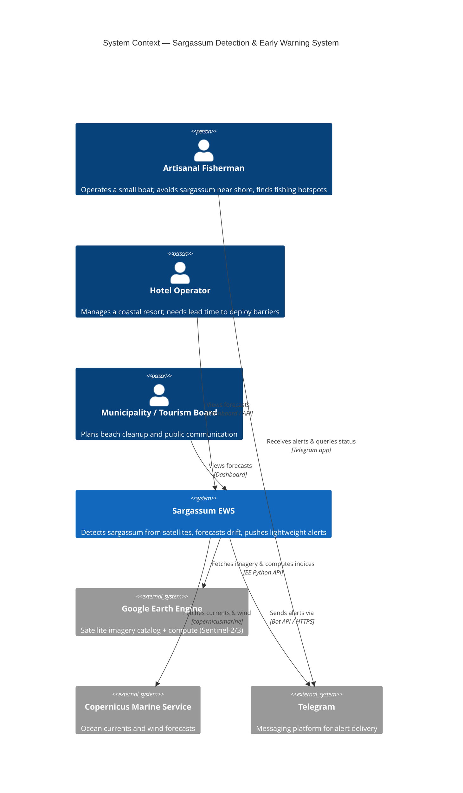
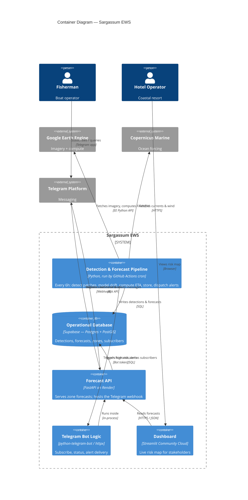
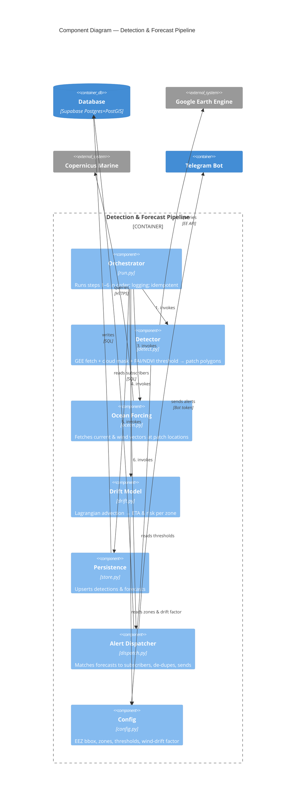
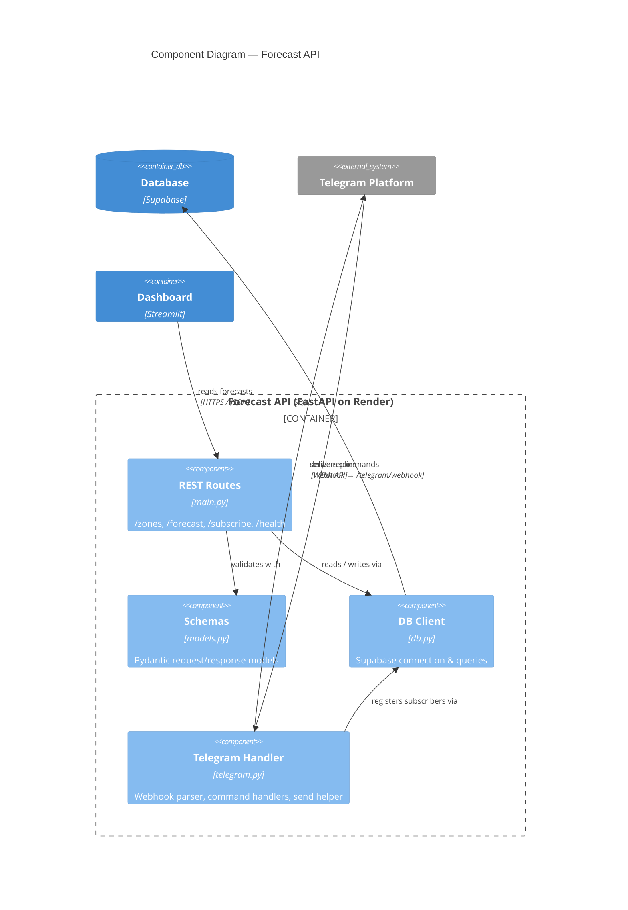
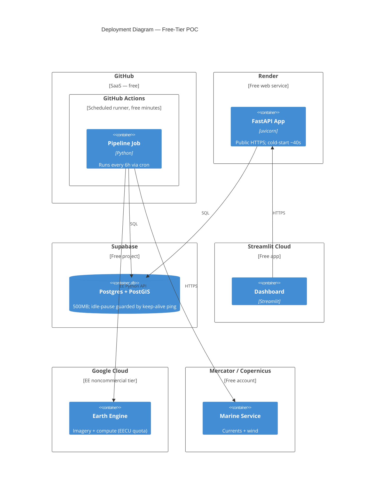
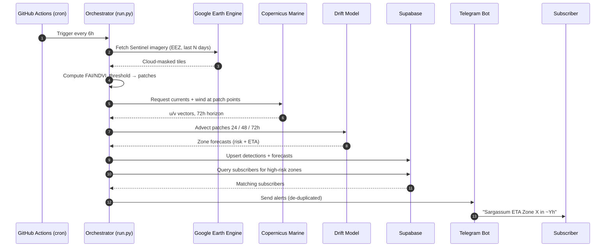
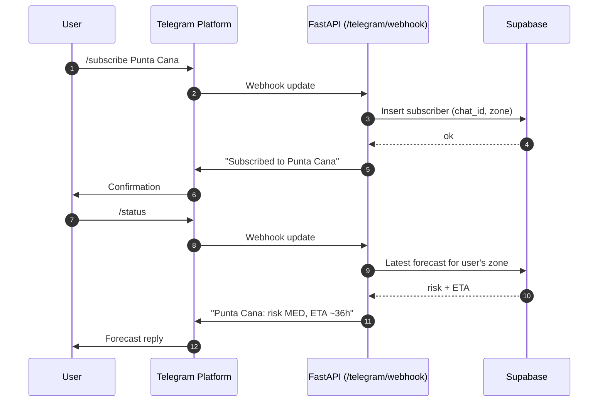
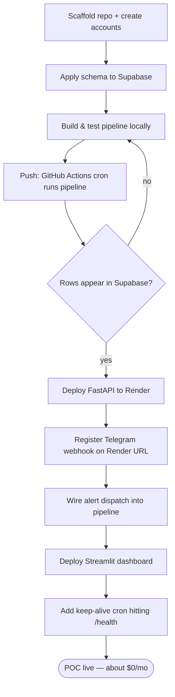
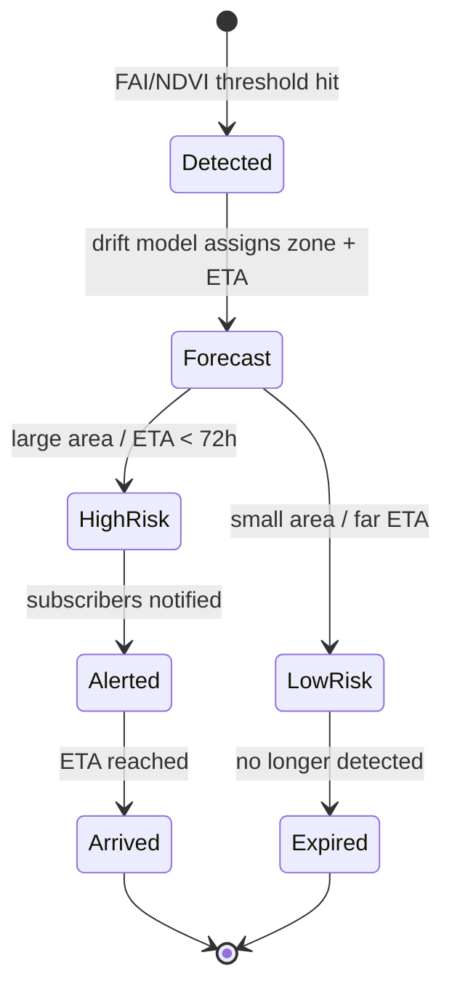

# Sargassum POC — C4 Architecture & Process Diagrams (Mermaid)

All diagrams are plain Mermaid source. Render them by:

* Pasting into **GitHub** (renders Mermaid in `.md` natively)
* **mermaid.live** (live editor + PNG/SVG export)
* **VS Code** with the *Markdown Preview Mermaid Support* extension
* Any docs tool that supports Mermaid (Docusaurus, MkDocs Material, Notion, Obsidian)

> Note: Mermaid's C4 support is still marked experimental. The diagrams below use stable syntax, but if your renderer is older and a C4 block fails, update Mermaid to v10+ or use [mermaid.live](https://mermaid.live/). For pixel-perfect C4 you can also paste the same structure into Structurizr DSL or PlantUML later — the model maps 1:1.

---

## Level 1 — System Context

The big picture: who uses the system and which external services it depends on.

---

## Level 2 — Container

The runnable pieces and how data moves between them. Each container is something you deploy.

---

## Level 3a — Component: Detection & Forecast Pipeline

Inside the pipeline container — the modules from the repo layout and the order the orchestrator calls them.

---

## Level 3b — Component: Forecast API

Inside the FastAPI container — routes, schemas, DB client, and the Telegram handler.

---

## Level 4 — Deployment (free-tier hosting)

Where each container physically runs and the cost posture of each node.

---

## Process — Pipeline run (sequence)

One scheduled run, steps 1–6, end to end.

---

## Process — Subscribe & status query (sequence)

The on-demand path users hit between pipeline runs.

---

## Process — Build & deploy order (flowchart)

The order that avoids circular dependencies between services.

---

## Process — Forecast lifecycle (state)

How a detection moves from a pixel signature to an alert and out.

---

## Mapping back to the repo

| Diagram element  | File / location                    |
| ---------------- | ---------------------------------- |
| Orchestrator     | `pipeline/run.py`                |
| Detector         | `pipeline/detect.py`             |
| Ocean Forcing    | `pipeline/ocean.py`              |
| Drift Model      | `pipeline/drift.py`              |
| Persistence      | `pipeline/store.py`              |
| Alert Dispatcher | `pipeline/dispatch.py`           |
| Config           | `pipeline/config.py`             |
| REST Routes      | `api/main.py`                    |
| Schemas          | `api/models.py`                  |
| DB Client        | `api/db.py`                      |
| Telegram Handler | `api/telegram.py`                |
| Dashboard        | `dashboard/app.py`               |
| Schema           | `sql/schema.sql`                 |
| Cron             | `.github/workflows/pipeline.yml` |
| Deploy config    | `render.yaml`                    |

Keep these diagrams in `docs/architecture.md` in the repo so they render on GitHub and stay next to the code they describe.
